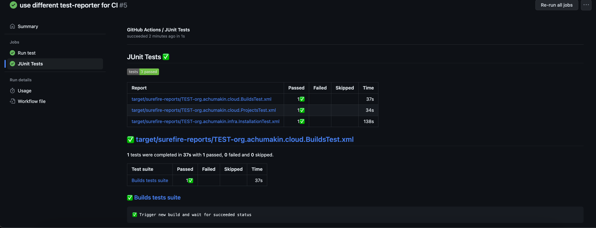
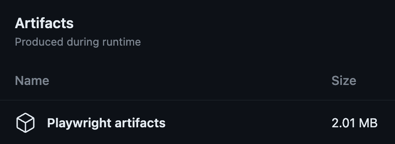

# TeamCity automated tests

This project represents implementation of the first 3 most important tests for critical parts of TeamCity functionality.
For a full list of test cases reach out [here](TESTS.md).

## Technical stack

- Java 17
- Maven 3.8
- Playwright for Java
- RestAssured
- Docker Compose

## Run cloud tests locally

In order to run all tests including infra-related functionality, reach out to the next section.

- Install Java 17+ version (follow [this](https://docs.oracle.com/en/java/javase/17/install/) instructions)
- Maven 3.8 (reach out to [this link](https://maven.apache.org/install.html))
- Build project with `mvn clean install -DskipTests`
- Run tests with `mvn test`

## Run all tests locally in Docker

I implemented an example of isolation front-end tests that verifies installation of TeamCity and Configuring of an Agent
using Docker Compose to show how such complex infrastructure-related tests could be configured. We can also run other

- Docker (follow [this link](https://docs.docker.com/engine/install/) for installation instructions)
- Docker Compose v2+ (installation steps can be found [here](https://docs.docker.com/compose/install/))
- Run infra tests with `docker-compose up --abort-on-container-exit`

**Note:** it's easy to change docker-compose approach to only run infra-related tests in this configuration and have a
separate one for Cloud tests. I'll leave it as is with a current amount of tests for a simpler CI setup.

## CI

[This](.github/workflows/github-actions-pipelines.yml) yaml-configuration run GutHub Actions pipeline on every push.
After tests are finished, we mount `target` folder from tests' container to the project repo and parse JUnit reports
with existing `test-reporter` pipe and shows the tests report in a separate view:

Screenshots and videos could be downloaded from Artifacts section:

For more detailed result overview reach out to
the [latest pipeline](https://github.com/alexandrchumakin/teamcity-tests/actions) details.

### Reporting

I only published Surefire JUnit report in CI, but to generate a test execution report from a local run,
use `mvn surefire-report:report -DskipTests` that will generate [HTML report](target/site/surefire-report.html) locally.

### Artifacts

Playwright will automatically record and save videos for every run under [target/videos](target/videos) folder and
screenshots for *failed* tests under [target/screenshots](target/screenshots) folder with a corresponding test name.
In order to implement automatic screenshots capture on failure, I created
[JUnitExtension](src/main/java/org/achumakin/extension/JUnitExtension.java) that overrides default behaviour of
JUnit hook that runs automatically after each scenario.

## Technical decisions

I personally prefer to follow [AAA principe](https://blog.ncrunch.net/post/arrange-act-assert-aaa-testing.aspx) for
building test automation where every test has all the required setup, performs actions and has an assertion or set of
soft assertions related to the same functionality. Another important thing for test automation is to make tests
independent of each other to be able to run them in parallel and identify all possible issues after run and see a root
cause of a problem in the earliest possible stage.

### Web test

Playwright was chosen as a tool for web automation as it's the most modern, fast and reliable frameworks for this
purpose. It wins in all possible aspects of all competitors including WebDriver that could be used with Java.
I used a classic page object pattern to wrap pages-related functionality in separate layer of test framework for ease of
use for this simple example.

#### Web synchronization

It's one of the most known problems in UI test automation that we need to wait enough time for elements to be rendered
and have appropriate state (clickable, visible etc.). Fortunately, Playwright implements the most of required syncs
under the hood, and we only need to implement additional synchronization like waiting for `save` icon to appear and then
wait until it's hidden. There are two main approaches for that: using `waitFor` method or Playwright built-in
`assertThat` function that was more appropriate in my case as it can operate with more controls' states.

### API test

In order to test build pipeline functionality without dependency on existing test that checks git project importing,
my TeamCity instance has pre-configured project that I can use to verify Build functionality.
This check is implemented in API level with using of RestAssured library. In this way we can keep tests independent
of each other and show different approaches for test automation depends on the application level under test.

#### API synchronization

Once we put a new build to a queue, we should wait until it's finished to check the final state. I used `awaitility`
library to dynamically wait for a `finished` build state to be able to verify the final build status.

### Yaml configuration

All the configurations are stored in a separate [config.yaml](src/main/resources/config.yml) file to easily maintain
this. The reason of using yaml format is to store configurations in non-flat format like properties-file and being able
to grow project configuration without a risk of having a huge unmaintainable config-file.
Config is parsed into custom Java model that allows to operate with config values like with any other complex object.
